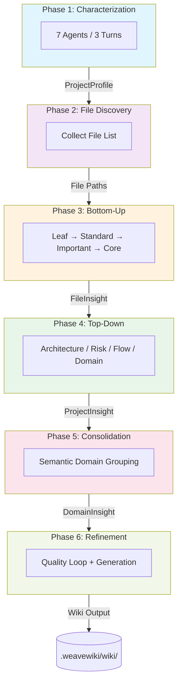
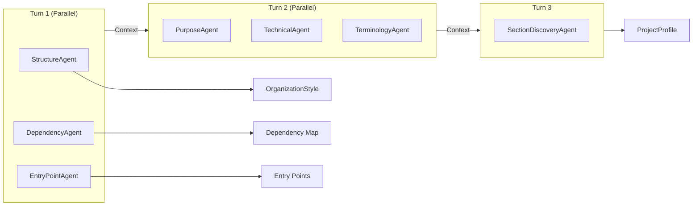
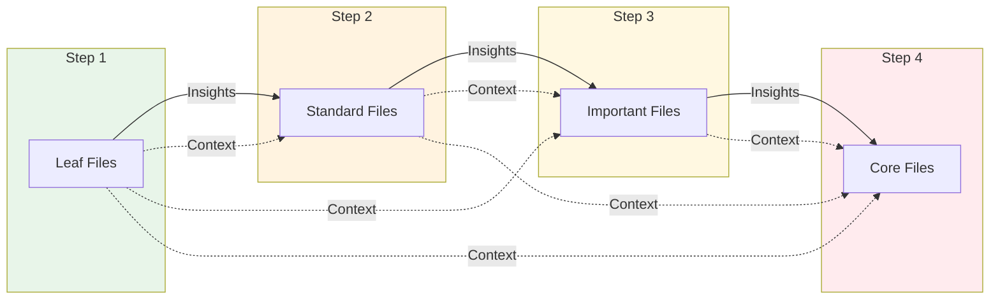
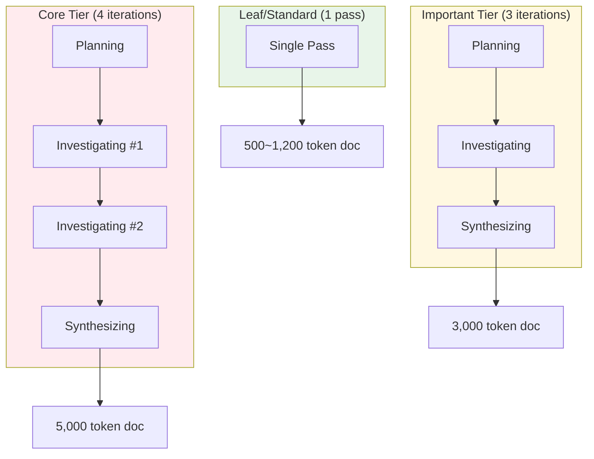
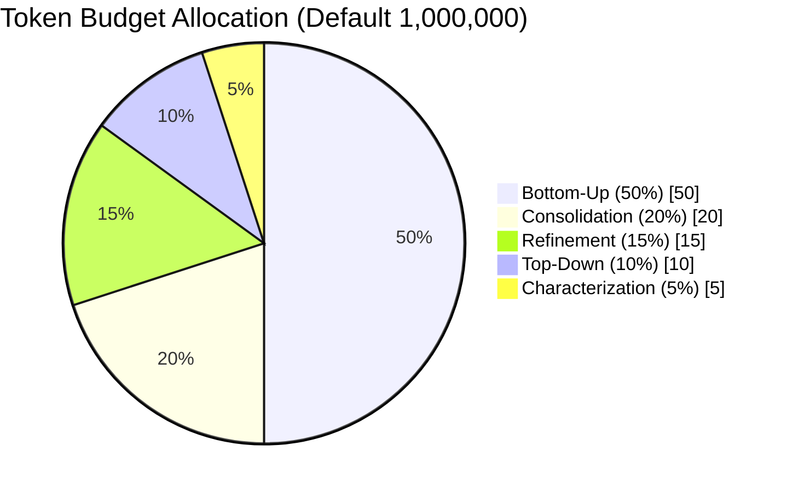
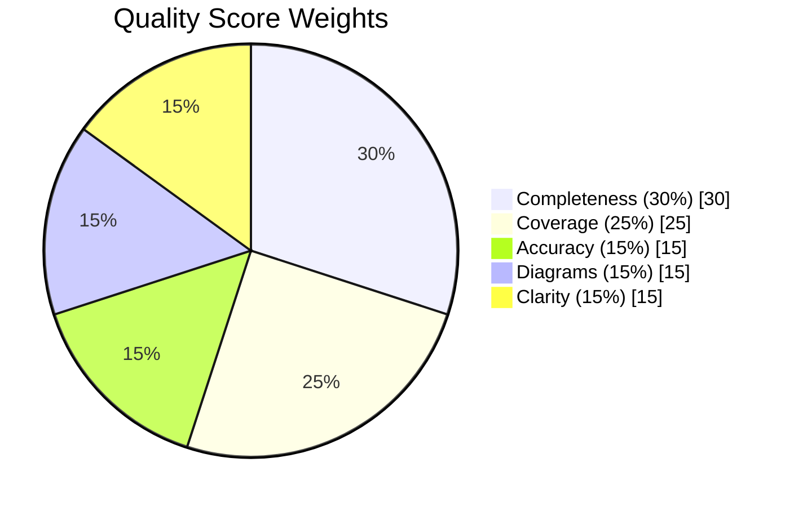
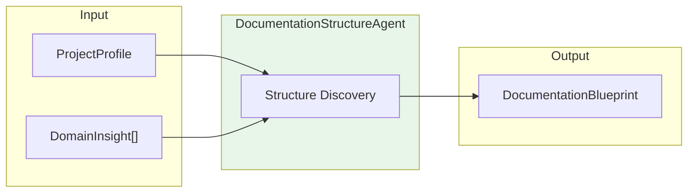
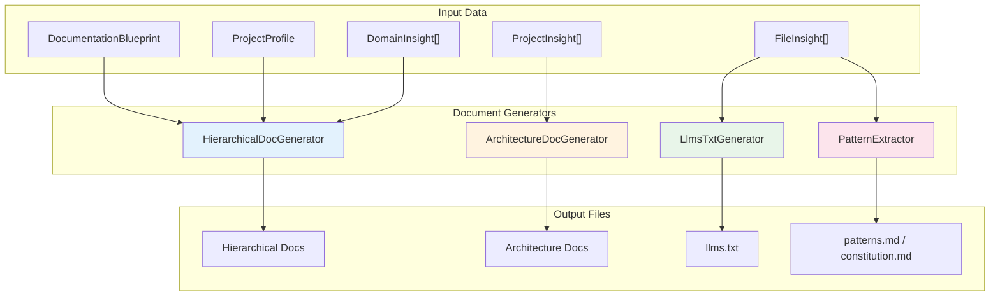

# WeaveWiki Architecture

> Technical deep-dive into the multi-agent documentation pipeline

---

## Overview

WeaveWiki implements a **6-phase multi-agent pipeline** that achieves 100% file coverage through hierarchical analysis. The system uses **turn-based agent coordination**, **leaf-first processing**, and **deep research iterations** to produce comprehensive, fact-based documentation.



---

## 1. Multi-Turn Characterization (Phase 1)

The characterization phase uses **7 specialized agents** executing across **3 sequential turns** with parallel execution within each turn.

### Turn Structure



| Turn | Agent | Output |
|:----:|-------|--------|
| **1** | StructureAgent | OrganizationStyle (DomainDriven, LayerBased, FeatureBased, Flat, Hybrid) |
| **1** | DependencyAgent | External/internal dependency map |
| **1** | EntryPointAgent | Main entry points (main.rs, index.ts, etc.) |
| **2** | PurposeAgent | Project purposes and goals |
| **2** | TechnicalAgent | Technical traits and stack |
| **2** | TerminologyAgent | Domain-specific terminology |
| **3** | SectionDiscoveryAgent | Dynamic documentation sections |

### Why Multi-Turn?

Each turn builds on previous insights:
- **Turn 1** provides structural foundation (how code is organized)
- **Turn 2** adds semantic understanding (what code does)
- **Turn 3** discovers domain-specific documentation needs

This layered approach produces a `ProjectProfile` that guides all downstream analysis.

### Agent Output

```rust
struct AgentOutput {
    agent_name: String,      // "structure", "dependency", etc.
    turn: u8,                // 1, 2, or 3
    insight_json: Value,     // Structured insights
    confidence: f32,         // 0.0-1.0
}
```

---

## 2. Bottom-Up Analysis with Deep Research (Phase 3)

### Processing Tier Classification

Files are classified into 4 tiers based on importance:

| Tier | Files | Iterations | Tokens | Criteria |
|------|-------|------------|--------|----------|
| **Leaf** | Utilities, helpers | 1 | ~500 | `/util`, `/helper`, `/common` paths |
| **Standard** | Normal files | 1 | ~1,200 | Default classification |
| **Important** | Business logic | 3 | ~3,000 | `/core`, `/business` paths, key areas |
| **Core** | Entry points | 4 | ~5,000 | main.rs, lib.rs, index.ts, entry points |

### Leaf-First Processing Order



**Why Leaf-First?**

Processing simpler files first enables hierarchical context building:

| Order | Tier | Available Context |
|:-----:|------|-------------------|
| 1 | **Leaf** | None (independent analysis) |
| 2 | **Standard** | Leaf insights |
| 3 | **Important** | Leaf + Standard insights |
| 4 | **Core** | All lower-tier insights (max 2,000 tokens) |

### Deep Research Algorithm

For Important (3 iterations) and Core (4 iterations) files:



Each iteration uses `ResearchPhase` enum to control prompt structure:

| Phase | Purpose | Description |
|-------|---------|-------------|
| `Planning` | Broad exploration | Build research plan, identify key aspects |
| `Investigating` | Focused analysis | Deep-dive into aspects, update understanding |
| `Synthesizing` | Final integration | Produce comprehensive documentation, cross-reference |

### Hierarchical Context Building

```rust
pub fn get_child_contexts(
    &self,
    file_path: &str,
    tier: ProcessingTier,
) -> Vec<ChildDocContext>
```

When analyzing a Core file, the system:
1. Queries `InsightRegistry` (DashMap) for lower-tier insights
2. Filters by directory relationship or import dependencies
3. Limits to 2,000 tokens to prevent context bloat
4. Passes as additional context to LLM

**Lock-Free Concurrency:**
- Uses `DashMap` for concurrent read/write without locks
- Multiple files analyzed in parallel within each tier
- No blocking at tier transitions

---

## 3. TALE: Token Allocation for LLM Efficiency

TALE is the token budget management system that enables predictable cost control.

### Phase Allocations



| Phase | Percent | Tokens (default) | Purpose |
|-------|:-------:|----------------:|---------|
| **Characterization** | 5% | 50,000 | 7 agents project profiling |
| **Bottom-Up** | 50% | 500,000 | All file analysis (largest portion) |
| **Top-Down** | 10% | 100,000 | 4 agents project-level analysis |
| **Consolidation** | 20% | 200,000 | Per-domain AI synthesis |
| **Refinement** | 15% | 150,000 | Quality improvement passes |

> **Reserve Buffer**: 5% (50,000 tokens for repairs/retries)

### Dynamic Reallocation

When a phase completes early, unused tokens transfer to subsequent phases:

```rust
pub fn reallocate_from_phase(&self, from_phase: u8, to_phase: u8) -> Result<u64> {
    let unused = self.remaining_for_phase(from_phase);

    // Mark source phase fully consumed (prevent double-spending)
    self.phase_consumed[from_phase].fetch_add(unused, Ordering::SeqCst);

    // Add unused to target phase limit
    self.phase_limits.add_to_phase(to_phase, unused)?;

    Ok(unused)
}
```

**Example:**
- Characterization uses 10,000 of 50,000 tokens
- 40,000 tokens reallocated to Bottom-Up
- Bottom-Up new limit: 500,000 + 40,000 = 540,000

### Enforcement Modes

| Mode | Behavior |
|------|----------|
| **Hard** (default) | Phase limits strictly enforced, returns `BudgetError::PhaseExceeded` |
| **Soft** | Logs warning, allows borrowing from global budget |

### Threshold Monitoring

```
75% utilization → WARNING log emitted
90% utilization → CRITICAL log + scope reduction recommended
```

### Complexity-Based Estimation

Pre-flight estimation before pipeline execution:

```rust
// Per-tier token costs
const TOKENS_LEAF: u64 = 800;
const TOKENS_STANDARD: u64 = 1500;
const TOKENS_IMPORTANT: u64 = 4000;   // ×3 for iterations
const TOKENS_CORE: u64 = 6000;        // ×4 for iterations

// Phase estimation
Characterization: 7 agents × 2,000 = 14,000
Bottom-Up: sum(tier_files × tier_cost × iterations)
Top-Down: 4 agents × 3,000 = 12,000
Consolidation: domains × 3,000
Refinement: 5 passes × 2,000 = 10,000
```

---

## 4. Multi-Dimensional Quality Scoring

### 5-Factor Scoring Model



| Dimension | Weight | Measurement |
|-----------|:------:|-------------|
| **Completeness** | 30% | Content richness (avg tokens / 1000) |
| **Coverage** | 25% | % of files documented |
| **Accuracy** | 15% | Valid cross-reference ratio |
| **Diagrams** | 15% | % with Mermaid diagrams |
| **Clarity** | 15% | Purpose statement quality (5-30 words optimal) |

```rust
// Weighted calculation (quality_scorer.rs:112-119)
overall = coverage * 0.25
        + completeness * 0.30
        + accuracy * 0.15
        + diagrams * 0.15
        + clarity * 0.15
```

### Quality Targets by Mode

| Mode | Small | Medium | Large | Enterprise |
|------|-------|--------|-------|------------|
| **Fast** | 0.60 | 0.60 | 0.65 | 0.65 |
| **Standard** | 0.75 | 0.80 | 0.85 | 0.90 |
| **Deep** | 0.85 | 0.90 | 0.92 | 0.95 |

### Refinement Iterations

Maximum turns based on mode × scale:

| Mode | Small | Medium | Large | Enterprise |
|------|-------|--------|-------|------------|
| **Fast** | 1 | 2 | 2 | 2 |
| **Standard** | 3 | 3 | 4 | 5 |
| **Deep** | 4 | 5 | 6 | 8 |

### Clarity Scoring Algorithm

```rust
fn score_purpose_clarity(purpose: &str) -> f32 {
    let word_count = purpose.split_whitespace().count();

    let length_score = match word_count {
        5..=30 => 1.0,           // Ideal length
        31.. => 0.7,             // Too verbose
        _ => word_count as f32 / 5.0,  // Too short
    };

    // Bonus for action verbs
    let verb_bonus = if contains_verbs(purpose) { 0.2 } else { 0.0 };

    (length_score * 0.8 + verb_bonus).min(1.0)
}
```

---

## 5. Domain Consolidation

### Semantic Domain Grouping

Unlike simple concatenation, consolidation uses **AI-driven synthesis**:

```
Input: 5-10 FileInsight documents per domain
Process: LLM synthesizes cohesive narrative
Output: Single DomainInsight with:
        - Unified overview (not copy-paste)
        - Inter-file relationships
        - Entry point guidance
        - Links to individual files
```

### Gap Detection

Automatically identifies:
- **Content gaps**: Domains with <100 words
- **Diagram gaps**: Domains without visualizations
- **Reference gaps**: Domains without cross-links

---

## 6. Documentation Generation Process

Documentation generation is performed in **Phase 5.5** and **Phase 6**.

### Phase 5.5: Documentation Structure Discovery

AI dynamically determines the optimal documentation structure for the project:



**DocumentationBlueprint Decision Factors:**

| Project Scale | Hierarchy Depth | Base Sections | Est. Pages |
|--------------|:---------------:|---------------|:----------:|
| **Small** | 1 | Getting Started, Architecture | 10-20 |
| **Medium** | 2 | + Development, API Reference | 30-50 |
| **Large** | 3 | + Deployment, Troubleshooting | 60-100 |
| **Enterprise** | 4 | + Security, Operations, Governance | 100+ |

### Phase 6: Document Generation

4 parallel generators produce various document formats:



### Generator Roles

| Generator | Input | Output Files | Role |
|-----------|-------|--------------|------|
| **HierarchicalDocGenerator** | Blueprint, Profile, DomainInsight | index.md, getting-started/, architecture/, development/, domains/ | Hierarchical doc structure |
| **ArchitectureDocGenerator** | Profile, ProjectInsight | architecture.md, risks.md, flows.md, terminology.md | Architecture analysis docs |
| **LlmsTxtGenerator** | DocSession, FileInsight | llms.txt | AI agent context |
| **PatternExtractor** | FileInsight | patterns.md, constitution.md | Code patterns & conventions |
| **DocGenerator** | DomainInsight | domains/*.md, _coverage.md | Legacy flat docs |

### Domain Document Structure Types

One of 3 structures is selected based on domain size:

```rust
enum DomainDocStructure {
    SinglePage,       // < 5 files: single page
    IndexWithPages,   // 5-20 files: index + subpages
    FullHierarchy,    // > 20 files: full hierarchy
}
```

---

## 7. Checkpoint & Resume

### Checkpoint Data Structure (Including Phase 5.5)

```rust
struct PipelineCheckpoint {
    version: u8,                    // Schema version
    checksum: u32,                  // CRC32 validation
    files: Vec<String>,
    project_profile_json: Option<String>,           // Phase 1
    file_insights_json: Option<String>,             // Phase 3
    project_insights_json: Option<String>,          // Phase 4
    domain_insights_json: Option<String>,           // Phase 5
    documentation_blueprint_json: Option<String>,   // Phase 5.5
    last_completed_phase: u8,       // 1-6
    checkpoint_at: String,
}
```

### Resume Logic

Each phase checks: `if resume_from < phase_number`
- **true** → Execute phase
- **false** → Load from checkpoint, skip to next

This enables:
- Graceful interruption at any point
- Resume from exact checkpoint
- No duplicate LLM calls

---

## 8. Concurrency Architecture

### Parallel Execution Points

```
Turn-Level Parallelism:
├── Turn 1: Structure | Dependency | EntryPoint (tokio::join!)
├── Turn 2: Purpose | Technical | Terminology (tokio::join!)
└── Top-Down: Architecture | Risk | Flow | Domain (tokio::join!)

Tier-Level Parallelism:
├── Within Leaf tier: buffer_unordered(concurrency)
├── Within Standard tier: buffer_unordered(concurrency)
├── Within Important tier: buffer_unordered(concurrency)
└── Within Core tier: buffer_unordered(concurrency)

Domain-Level Parallelism:
└── Domain synthesis: buffer_unordered(MAX_DOMAIN_CONCURRENCY)
```

### Lock-Free Design

`InsightRegistry` uses `DashMap` for:
- **O(1) concurrent reads**: Child context lookups
- **O(1) concurrent writes**: Insight registration
- **No RwLock bottleneck**: Eliminated global lock ordering

---

## 9. Output Structure

### Complete File Structure

```
.weavewiki/wiki/
├── index.md                    # Project overview
├── llms.txt                    # AI agent context
├── patterns.md                 # Discovered code patterns
├── constitution.md             # Coding conventions
├── _coverage.md                # Quality metrics report
│
├── architecture.md             # Architecture analysis (Top-Down)
├── risks.md                    # Risk analysis (Top-Down)
├── flows.md                    # Data/business flows (Top-Down)
├── terminology.md              # Domain glossary
│
├── getting-started/            # Getting started guide (Blueprint-based)
│   ├── index.md
│   ├── installation.md
│   ├── configuration.md
│   └── quick-start.md
│
├── architecture/               # Architecture section (Blueprint-based)
│   ├── index.md
│   ├── data-flow.md
│   └── patterns.md
│
├── development/                # Development guide (Blueprint-based)
│   ├── index.md
│   ├── setup.md
│   └── contributing.md
│
└── domains/                    # Domain-specific docs
    ├── index.md                # Domain list
    ├── {domain_name}/          # Per-domain directory
    │   ├── index.md            # Domain synthesis (AI)
    │   └── *.md                # Subpages (based on scale)
    └── ...
```

### File Generation Sources

| File | Generator | Data Source |
|------|-----------|-------------|
| `index.md` | HierarchicalDocGenerator | ProjectProfile, DomainInsight |
| `llms.txt` | LlmsTxtGenerator | DocSession, FileInsight |
| `patterns.md` | PatternExtractor | FileInsight (25+ patterns) |
| `constitution.md` | PatternExtractor | FileInsight (convention inference) |
| `_coverage.md` | DocGenerator | QualityScore, DomainInsight |
| `architecture.md` | ArchitectureDocGenerator | ProjectInsight (architecture agent) |
| `risks.md` | ArchitectureDocGenerator | ProjectInsight (risk agent) |
| `flows.md` | ArchitectureDocGenerator | ProjectInsight (flow agent) |
| `terminology.md` | ArchitectureDocGenerator | ProjectInsight (domain agent) |
| `getting-started/*` | HierarchicalDocGenerator | DocumentationBlueprint |
| `architecture/*` | HierarchicalDocGenerator | DocumentationBlueprint, ProjectInsight |
| `development/*` | HierarchicalDocGenerator | DocumentationBlueprint |
| `domains/*` | HierarchicalDocGenerator + DocGenerator | DomainInsight, FileInsight |

---

## Summary

| Component | Key Innovation |
|-----------|----------------|
| **Multi-Turn Agents** | Layered insight building (structure → semantics → sections) |
| **Deep Research** | 3-4 iteration refinement for critical files |
| **Leaf-First** | Hierarchical context from simple to complex |
| **TALE Budget** | Predictable cost with dynamic reallocation |
| **Quality Scoring** | 5-dimension weighted assessment |
| **Consolidation** | AI synthesis, not concatenation |
| **Doc Generation** | Blueprint-based hierarchical docs + 4 parallel generators |
| **Resume** | Checkpoint at every phase boundary (including Phase 5.5) |

This architecture ensures **100% file coverage** while maintaining **quality targets** within **predictable token budgets**.
