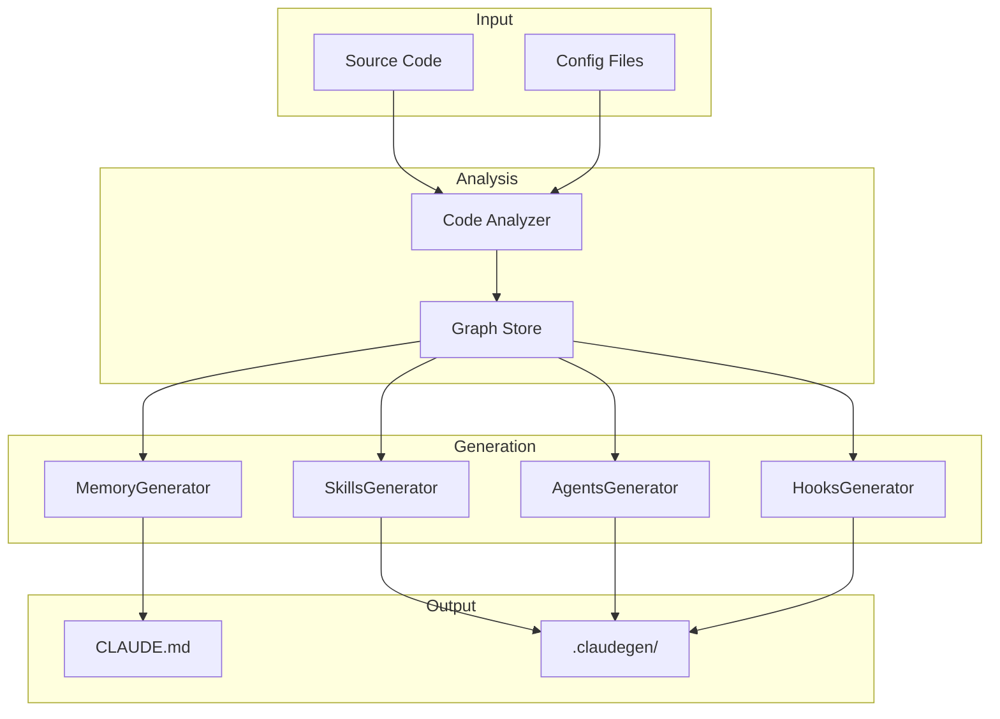

# claudegen Architecture

> Claude Code Plugin Generator

---

## Overview

claudegen automatically generates **official Claude Code plugin format** output through codebase analysis.


```mermaid
flowchart TB
    subgraph Input["Input"]
        SC[Source Code]
        CFG[Config Files]
    end

    subgraph Analysis["Analysis"]
        AN[Code Analyzer]
        GS[Graph Store]
    end

    subgraph Generation["Generation"]
        MG[MemoryGenerator]
        SG[SkillsGenerator]
        AG[AgentsGenerator]
        HG[HooksGenerator]
    end

    subgraph Output["Output"]
        CM[CLAUDE.md]
        PD[.claudegen/]
    end

    SC --> AN
    CFG --> AN
    AN --> GS
    GS --> MG
    GS --> SG
    GS --> AG
    GS --> HG
    MG --> CM
    SG --> PD
    AG --> PD
    HG --> PD
```

---

## Output Structure

```
project/
├── CLAUDE.md                          # Project memory
└── .claudegen/                        # Plugin directory
    ├── .claude-plugin/
    │   └── plugin.json                # Plugin manifest
    ├── skills/
    │   └── {skill-name}/
    │       └── SKILL.md               # Skill with YAML frontmatter
    └── agents/
        └── {agent-name}.md            # Agent definitions
```

---

## Core Modules

| Module | Role |
|--------|------|
| `generator/` | Plugin generation pipeline |
| `ai/provider/` | LLM provider chain |
| `analyzer/` | Code analysis and parsing |
| `storage/` | SQLite graph store |
| `harness/` | Ralph Loop orchestration |
| `verifier/` | Output verification |

---

## CLI Commands

```
claudegen init        # Initialize
claudegen generate    # Generate plugin
claudegen analyze     # Analyze codebase
claudegen status      # Check status
claudegen validate    # Verify output
claudegen clean       # Cleanup
```
