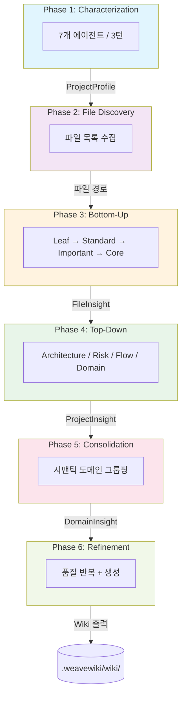
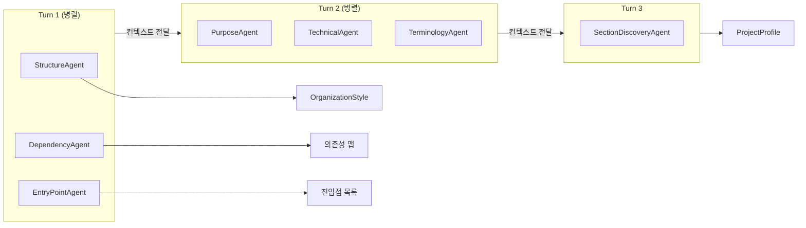
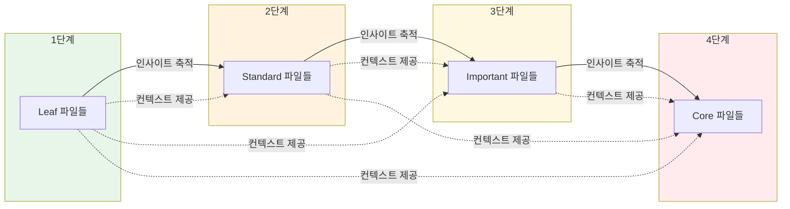
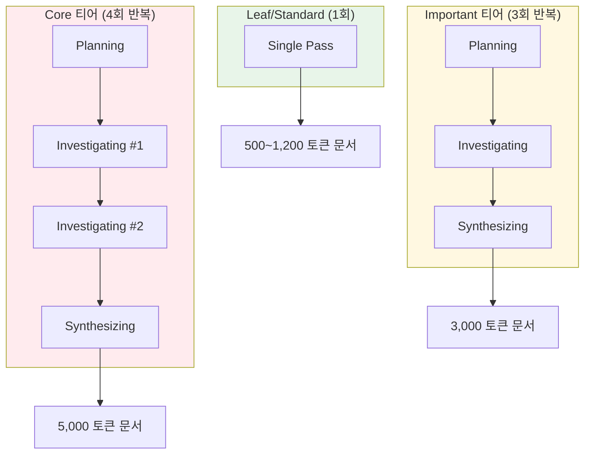
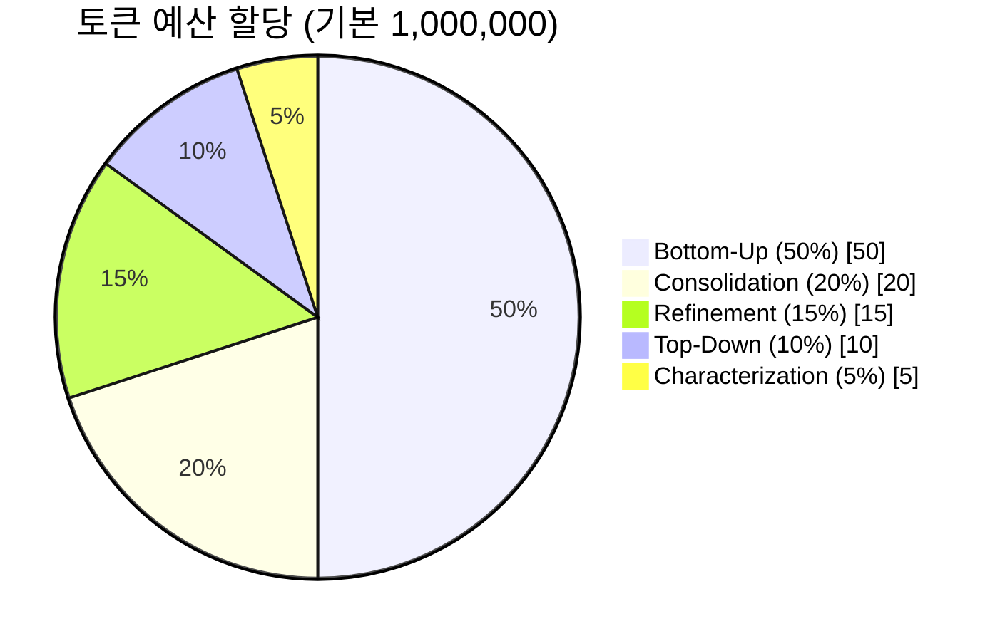
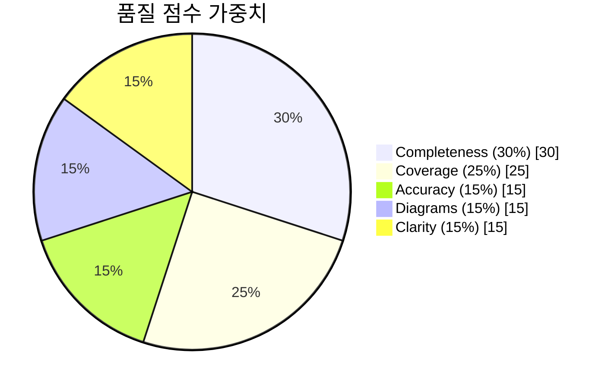

# WeaveWiki 아키텍처

> 멀티 에이전트 문서화 파이프라인 기술 심층 분석

---

## 개요

WeaveWiki는 **6단계 멀티 에이전트 파이프라인**을 구현하여 계층적 분석을 통해 100% 파일 커버리지를 달성합니다. **턴 기반 에이전트 조율**, **Leaf-First 처리**, **Deep Research 반복**을 사용하여 포괄적이고 사실 기반의 문서를 생성합니다.



---

## 1. 멀티턴 Characterization (Phase 1)

Characterization 단계는 **7개의 전문 에이전트**가 **3개의 순차 턴**에 걸쳐 실행되며, 각 턴 내에서는 병렬 실행됩니다.

### 턴 구조



| 턴 | 에이전트 | 출력 |
|:---:|----------|------|
| **1** | StructureAgent | OrganizationStyle (DomainDriven, LayerBased, FeatureBased, Flat, Hybrid) |
| **1** | DependencyAgent | 외부/내부 의존성 맵 |
| **1** | EntryPointAgent | 주요 진입점 (main.rs, index.ts 등) |
| **2** | PurposeAgent | 프로젝트 목적과 목표 |
| **2** | TechnicalAgent | 기술 특성과 스택 |
| **2** | TerminologyAgent | 도메인 특화 용어 |
| **3** | SectionDiscoveryAgent | 동적 문서 섹션 |

### 왜 멀티턴인가?

각 턴은 이전 인사이트를 기반으로 구축됩니다:
- **Turn 1**은 구조적 기반 제공 (코드가 어떻게 조직되어 있는지)
- **Turn 2**는 의미적 이해 추가 (코드가 무엇을 하는지)
- **Turn 3**는 도메인 특화 문서화 요구사항 발견

이 계층적 접근은 모든 후속 분석을 가이드하는 `ProjectProfile`을 생성합니다.

### 에이전트 출력

```rust
struct AgentOutput {
    agent_name: String,      // "structure", "dependency" 등
    turn: u8,                // 1, 2, 또는 3
    insight_json: Value,     // 구조화된 인사이트
    confidence: f32,         // 0.0-1.0
}
```

---

## 2. Deep Research를 활용한 Bottom-Up 분석 (Phase 3)

### 처리 티어 분류

파일은 중요도에 따라 4개 티어로 분류됩니다:

| 티어 | 파일 유형 | 반복 횟수 | 토큰 | 기준 |
|------|-----------|----------|------|------|
| **Leaf** | 유틸리티, 헬퍼 | 1 | ~500 | `/util`, `/helper`, `/common` 경로 |
| **Standard** | 일반 파일 | 1 | ~1,200 | 기본 분류 |
| **Important** | 비즈니스 로직 | 3 | ~3,000 | `/core`, `/business` 경로, 핵심 영역 |
| **Core** | 진입점 | 4 | ~5,000 | main.rs, lib.rs, index.ts, 진입점 |

### Leaf-First 처리 순서



**왜 Leaf-First인가?**

단순한 파일을 먼저 처리하면 계층적 컨텍스트 구축이 가능합니다:

| 순서 | 티어 | 참조 가능한 컨텍스트 |
|:----:|------|---------------------|
| 1 | **Leaf** | 없음 (독립 분석) |
| 2 | **Standard** | Leaf 인사이트 |
| 3 | **Important** | Leaf + Standard 인사이트 |
| 4 | **Core** | 모든 하위 티어 인사이트 (최대 2,000 토큰) |

### Deep Research 알고리즘

Important (3회 반복) 및 Core (4회 반복) 파일의 경우:



각 반복은 프롬프트 구조를 제어하는 `ResearchPhase` 열거형을 사용합니다:

| Phase | 목적 | 설명 |
|-------|------|------|
| `Planning` | 넓은 탐색 | 리서치 계획 수립, 핵심 측면 식별 |
| `Investigating` | 집중 분석 | 측면별 심층 조사, 이해도 업데이트 |
| `Synthesizing` | 최종 통합 | 포괄적 문서 생성, 자식 컨텍스트 교차 참조 |

### 계층적 컨텍스트 구축

```rust
pub fn get_child_contexts(
    &self,
    file_path: &str,
    tier: ProcessingTier,
) -> Vec<ChildDocContext>
```

Core 파일 분석 시 시스템은:
1. 하위 티어 인사이트를 `InsightRegistry` (DashMap)에서 조회
2. 디렉토리 관계 또는 import 의존성으로 필터링
3. 컨텍스트 비대화 방지를 위해 2,000 토큰으로 제한
4. LLM에 추가 컨텍스트로 전달

**Lock-Free 동시성:**
- 락 없이 동시 읽기/쓰기를 위해 `DashMap` 사용
- 각 티어 내에서 여러 파일 병렬 분석
- 티어 전환 시 블로킹 없음

---

## 3. TALE: Token Allocation for LLM Efficiency

TALE은 예측 가능한 비용 제어를 가능하게 하는 토큰 예산 관리 시스템입니다.

### 단계별 할당



| 단계 | 비율 | 토큰 (기본값) | 용도 |
|------|:----:|-------------:|------|
| **Characterization** | 5% | 50,000 | 7개 에이전트 프로젝트 프로파일링 |
| **Bottom-Up** | 50% | 500,000 | 전체 파일 분석 (가장 큰 비중) |
| **Top-Down** | 10% | 100,000 | 4개 에이전트 프로젝트 레벨 분석 |
| **Consolidation** | 20% | 200,000 | 도메인별 AI 합성 |
| **Refinement** | 15% | 150,000 | 품질 반복 개선 |

> **예비 버퍼**: 5% (수리/재시도를 위한 50,000 토큰)

### 동적 재할당

단계가 일찍 완료되면 사용되지 않은 토큰이 후속 단계로 이전됩니다:

```rust
pub fn reallocate_from_phase(&self, from_phase: u8, to_phase: u8) -> Result<u64> {
    let unused = self.remaining_for_phase(from_phase);

    // 이중 지출 방지를 위해 소스 단계를 완전히 소비된 것으로 표시
    self.phase_consumed[from_phase].fetch_add(unused, Ordering::SeqCst);

    // 사용되지 않은 토큰을 타겟 단계 한도에 추가
    self.phase_limits.add_to_phase(to_phase, unused)?;

    Ok(unused)
}
```

**예시:**
- Characterization이 50,000 토큰 중 10,000만 사용
- 40,000 토큰이 Bottom-Up으로 재할당
- Bottom-Up 새 한도: 500,000 + 40,000 = 540,000

### 집행 모드

| 모드 | 동작 |
|------|------|
| **Hard** (기본값) | 단계 한도 엄격 적용, `BudgetError::PhaseExceeded` 반환 |
| **Soft** | 경고 로그 후 글로벌 예산에서 차용 허용 |

### 임계값 모니터링

```
75% 사용률 → WARNING 로그 발생
90% 사용률 → CRITICAL 로그 + 범위 축소 권장
```

### 복잡도 기반 추정

파이프라인 실행 전 사전 추정:

```rust
// 티어별 토큰 비용
const TOKENS_LEAF: u64 = 800;
const TOKENS_STANDARD: u64 = 1500;
const TOKENS_IMPORTANT: u64 = 4000;   // 반복으로 ×3
const TOKENS_CORE: u64 = 6000;        // 반복으로 ×4

// 단계 추정
Characterization: 7 에이전트 × 2,000 = 14,000
Bottom-Up: sum(티어_파일수 × 티어_비용 × 반복횟수)
Top-Down: 4 에이전트 × 3,000 = 12,000
Consolidation: 도메인수 × 3,000
Refinement: 5 패스 × 2,000 = 10,000
```

---

## 4. 다차원 품질 점수 평가

### 5요소 점수 모델



| 차원 | 가중치 | 측정 기준 |
|------|:------:|----------|
| **Completeness** | 30% | 콘텐츠 풍부도 (평균 토큰 / 1000) |
| **Coverage** | 25% | 문서화된 파일 비율 |
| **Accuracy** | 15% | 유효한 교차 참조 비율 |
| **Diagrams** | 15% | Mermaid 다이어그램 포함 비율 |
| **Clarity** | 15% | 목적 설명 품질 (5-30 단어 최적) |

```rust
// 가중치 계산 (quality_scorer.rs:112-119)
overall = coverage * 0.25
        + completeness * 0.30
        + accuracy * 0.15
        + diagrams * 0.15
        + clarity * 0.15
```

### 모드별 품질 목표

| 모드 | Small | Medium | Large | Enterprise |
|------|-------|--------|-------|------------|
| **Fast** | 0.60 | 0.60 | 0.65 | 0.65 |
| **Standard** | 0.75 | 0.80 | 0.85 | 0.90 |
| **Deep** | 0.85 | 0.90 | 0.92 | 0.95 |

### 정제 반복 횟수

모드 × 규모에 따른 최대 턴:

| 모드 | Small | Medium | Large | Enterprise |
|------|-------|--------|-------|------------|
| **Fast** | 1 | 2 | 2 | 2 |
| **Standard** | 3 | 3 | 4 | 5 |
| **Deep** | 4 | 5 | 6 | 8 |

### 명확도 점수 알고리즘

```rust
fn score_purpose_clarity(purpose: &str) -> f32 {
    let word_count = purpose.split_whitespace().count();

    let length_score = match word_count {
        5..=30 => 1.0,           // 이상적인 길이
        31.. => 0.7,             // 너무 장황함
        _ => word_count as f32 / 5.0,  // 너무 짧음
    };

    // 동작 동사 보너스
    let verb_bonus = if contains_verbs(purpose) { 0.2 } else { 0.0 };

    (length_score * 0.8 + verb_bonus).min(1.0)
}
```

---

## 5. 도메인 통합

### 시맨틱 도메인 그룹핑

단순 연결이 아닌 **AI 기반 합성**을 사용합니다:

```
입력: 도메인당 5-10개의 FileInsight 문서
처리: LLM이 일관된 내러티브로 합성
출력: 단일 DomainInsight:
      - 통합된 개요 (복사-붙여넣기 아님)
      - 파일 간 관계
      - 진입점 가이드
      - 개별 파일 링크
```

### 갭 탐지

자동으로 식별:
- **콘텐츠 갭**: 100 단어 미만의 도메인
- **다이어그램 갭**: 시각화 없는 도메인
- **참조 갭**: 교차 링크 없는 도메인

---

## 6. 문서 생성 프로세스

문서 생성은 **Phase 5.5**와 **Phase 6**에서 수행됩니다.

### Phase 5.5: 문서 구조 발견

AI가 프로젝트에 최적화된 문서 구조를 동적으로 결정합니다:

```mermaid
flowchart LR
    subgraph Input["입력"]
        PP[ProjectProfile]
        DI[DomainInsight[]]
    end

    subgraph Agent["DocumentationStructureAgent"]
        DS[구조 발견]
    end

    subgraph Output["출력"]
        BP[DocumentationBlueprint]
    end

    PP --> DS
    DI --> DS
    DS --> BP

    style Agent fill:#e8f5e9
```

**DocumentationBlueprint 결정 요소:**

| 프로젝트 규모 | 계층 깊이 | 기본 섹션 | 예상 페이지 |
|--------------|:--------:|----------|:-----------:|
| **Small** | 1 | Getting Started, Architecture | 10-20 |
| **Medium** | 2 | + Development, API Reference | 30-50 |
| **Large** | 3 | + Deployment, Troubleshooting | 60-100 |
| **Enterprise** | 4 | + Security, Operations, Governance | 100+ |

### Phase 6: 문서 생성

4개의 병렬 생성기가 다양한 형식의 문서를 생성합니다:

```mermaid
flowchart TB
    subgraph Input["입력 데이터"]
        BP[DocumentationBlueprint]
        PP[ProjectProfile]
        DI[DomainInsight[]]
        PI[ProjectInsight[]]
        FI[FileInsight[]]
    end

    subgraph Generators["문서 생성기"]
        HG[HierarchicalDocGenerator]
        AG[ArchitectureDocGenerator]
        LG[LlmsTxtGenerator]
        PG[PatternExtractor]
    end

    subgraph Output["출력 파일"]
        H1[계층적 문서]
        H2[아키텍처 문서]
        H3[llms.txt]
        H4[patterns.md / constitution.md]
    end

    BP --> HG
    PP --> HG
    DI --> HG
    PI --> AG
    FI --> LG
    FI --> PG

    HG --> H1
    AG --> H2
    LG --> H3
    PG --> H4

    style HG fill:#e3f2fd
    style AG fill:#fff3e0
    style LG fill:#e8f5e9
    style PG fill:#fce4ec
```

### 생성기별 역할

| 생성기 | 입력 | 출력 파일 | 역할 |
|--------|------|----------|------|
| **HierarchicalDocGenerator** | Blueprint, Profile, DomainInsight | index.md, getting-started/, architecture/, development/, domains/ | 계층적 문서 구조 생성 |
| **ArchitectureDocGenerator** | Profile, ProjectInsight | architecture.md, risks.md, flows.md, terminology.md | 아키텍처 분석 문서 |
| **LlmsTxtGenerator** | DocSession, FileInsight | llms.txt | AI 에이전트용 컨텍스트 |
| **PatternExtractor** | FileInsight | patterns.md, constitution.md | 코드 패턴 및 컨벤션 |
| **DocGenerator** | DomainInsight | domains/*.md, _coverage.md | 레거시 플랫 문서 |

### 도메인 문서 구조 타입

도메인 크기에 따라 3가지 구조 중 하나가 선택됩니다:

```rust
enum DomainDocStructure {
    SinglePage,       // < 5 파일: 단일 페이지
    IndexWithPages,   // 5-20 파일: 인덱스 + 서브페이지
    FullHierarchy,    // > 20 파일: 전체 계층 구조
}
```

---

## 7. 체크포인트 & 재개

### 체크포인트 데이터 구조 (Phase 5.5 포함)

```rust
struct PipelineCheckpoint {
    version: u8,                    // 스키마 버전
    checksum: u32,                  // CRC32 검증
    files: Vec<String>,
    project_profile_json: Option<String>,           // Phase 1
    file_insights_json: Option<String>,             // Phase 3
    project_insights_json: Option<String>,          // Phase 4
    domain_insights_json: Option<String>,           // Phase 5
    documentation_blueprint_json: Option<String>,   // Phase 5.5
    last_completed_phase: u8,       // 1-6
    checkpoint_at: String,
}
```

### 재개 로직

각 단계는 확인: `if resume_from < phase_number`
- **true** → 단계 실행
- **false** → 체크포인트에서 로드, 다음으로 건너뛰기

이를 통해:
- 어느 지점에서든 우아한 중단
- 정확한 체크포인트에서 재개
- 중복 LLM 호출 없음

---

## 8. 동시성 아키텍처

### 병렬 실행 지점

```
턴 레벨 병렬성:
├── Turn 1: Structure | Dependency | EntryPoint (tokio::join!)
├── Turn 2: Purpose | Technical | Terminology (tokio::join!)
└── Top-Down: Architecture | Risk | Flow | Domain (tokio::join!)

티어 레벨 병렬성:
├── Leaf 티어 내: buffer_unordered(concurrency)
├── Standard 티어 내: buffer_unordered(concurrency)
├── Important 티어 내: buffer_unordered(concurrency)
└── Core 티어 내: buffer_unordered(concurrency)

도메인 레벨 병렬성:
└── 도메인 합성: buffer_unordered(MAX_DOMAIN_CONCURRENCY)
```

### Lock-Free 설계

`InsightRegistry`는 `DashMap`을 사용:
- **O(1) 동시 읽기**: 자식 컨텍스트 조회
- **O(1) 동시 쓰기**: 인사이트 등록
- **RwLock 병목 없음**: 글로벌 락 순서 제거

---

## 9. 출력 구조

### 전체 파일 구조

```
.weavewiki/wiki/
├── index.md                    # 프로젝트 개요
├── llms.txt                    # AI 에이전트 컨텍스트
├── patterns.md                 # 발견된 코드 패턴
├── constitution.md             # 코딩 컨벤션
├── _coverage.md                # 품질 메트릭 리포트
│
├── architecture.md             # 아키텍처 분석 (Top-Down)
├── risks.md                    # 리스크 분석 (Top-Down)
├── flows.md                    # 데이터/비즈니스 흐름 (Top-Down)
├── terminology.md              # 도메인 용어 사전
│
├── getting-started/            # 시작 가이드 (Blueprint 기반)
│   ├── index.md
│   ├── installation.md
│   ├── configuration.md
│   └── quick-start.md
│
├── architecture/               # 아키텍처 섹션 (Blueprint 기반)
│   ├── index.md
│   ├── data-flow.md
│   └── patterns.md
│
├── development/                # 개발 가이드 (Blueprint 기반)
│   ├── index.md
│   ├── setup.md
│   └── contributing.md
│
└── domains/                    # 도메인별 문서
    ├── index.md                # 도메인 목록
    ├── {domain_name}/          # 도메인별 디렉토리
    │   ├── index.md            # 도메인 합성 (AI)
    │   └── *.md                # 서브페이지 (규모에 따라)
    └── ...
```

### 파일별 생성 소스

| 파일 | 생성기 | 데이터 소스 |
|------|--------|------------|
| `index.md` | HierarchicalDocGenerator | ProjectProfile, DomainInsight |
| `llms.txt` | LlmsTxtGenerator | DocSession, FileInsight |
| `patterns.md` | PatternExtractor | FileInsight (25+ 패턴 감지) |
| `constitution.md` | PatternExtractor | FileInsight (컨벤션 추론) |
| `_coverage.md` | DocGenerator | QualityScore, DomainInsight |
| `architecture.md` | ArchitectureDocGenerator | ProjectInsight (architecture agent) |
| `risks.md` | ArchitectureDocGenerator | ProjectInsight (risk agent) |
| `flows.md` | ArchitectureDocGenerator | ProjectInsight (flow agent) |
| `terminology.md` | ArchitectureDocGenerator | ProjectInsight (domain agent) |
| `getting-started/*` | HierarchicalDocGenerator | DocumentationBlueprint |
| `architecture/*` | HierarchicalDocGenerator | DocumentationBlueprint, ProjectInsight |
| `development/*` | HierarchicalDocGenerator | DocumentationBlueprint |
| `domains/*` | HierarchicalDocGenerator + DocGenerator | DomainInsight, FileInsight |

---

## 요약

| 컴포넌트 | 핵심 혁신 |
|----------|----------|
| **멀티턴 에이전트** | 계층적 인사이트 구축 (구조 → 의미 → 섹션) |
| **Deep Research** | 중요 파일에 대한 3-4회 반복 정제 |
| **Leaf-First** | 단순→복잡 계층적 컨텍스트 |
| **TALE 예산** | 동적 재할당을 통한 예측 가능한 비용 |
| **품질 점수** | 5차원 가중치 평가 |
| **통합** | 연결이 아닌 AI 합성 |
| **문서 생성** | Blueprint 기반 계층적 문서 + 4개 병렬 생성기 |
| **재개** | 모든 단계 경계에서 체크포인트 (Phase 5.5 포함) |

이 아키텍처는 **예측 가능한 토큰 예산** 내에서 **품질 목표**를 유지하면서 **100% 파일 커버리지**를 보장합니다.
