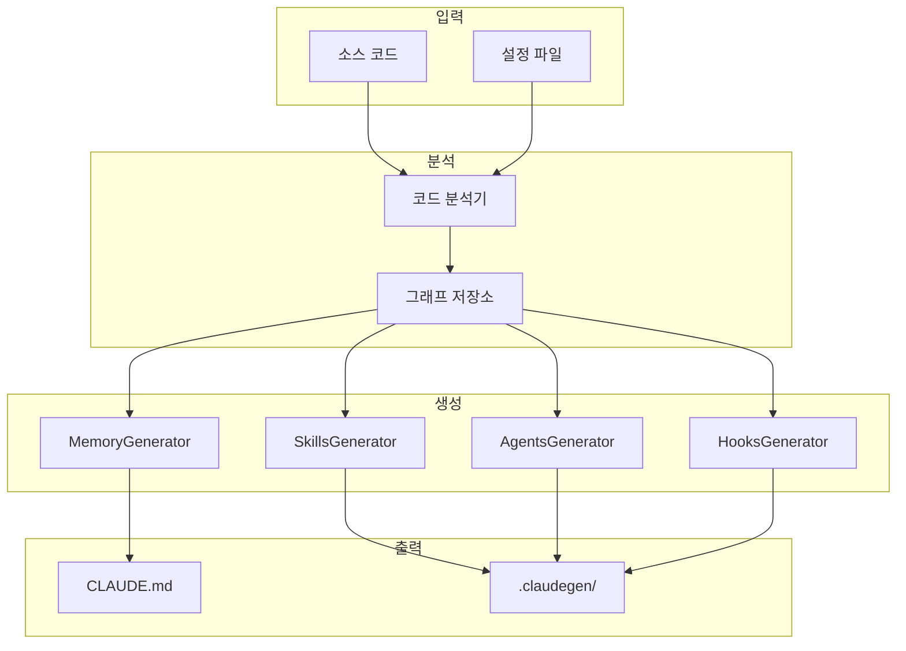

# claudegen 아키텍처

> Claude Code 플러그인 자동 생성 시스템

---

## 개요

claudegen은 코드베이스 분석을 통해 **공식 Claude Code 플러그인 형식**의 출력물을 자동 생성합니다.


```mermaid
flowchart TB
    subgraph Input["입력"]
        SC[소스 코드]
        CFG[설정 파일]
    end

    subgraph Analysis["분석"]
        AN[코드 분석기]
        GS[그래프 저장소]
    end

    subgraph Generation["생성"]
        MG[MemoryGenerator]
        SG[SkillsGenerator]
        AG[AgentsGenerator]
        HG[HooksGenerator]
    end

    subgraph Output["출력"]
        CM[CLAUDE.md]
        PD[.claudegen/]
    end

    SC --> AN
    CFG --> AN
    AN --> GS
    GS --> MG
    GS --> SG
    GS --> AG
    GS --> HG
    MG --> CM
    SG --> PD
    AG --> PD
    HG --> PD
```

---

## 출력 구조

```
project/
├── CLAUDE.md                          # 프로젝트 메모리
└── .claudegen/                        # 플러그인 디렉토리
    ├── .claude-plugin/
    │   └── plugin.json                # 플러그인 매니페스트
    ├── skills/
    │   └── {skill-name}/
    │       └── SKILL.md               # YAML 프론트매터 포함 스킬
    └── agents/
        └── {agent-name}.md            # 에이전트 정의
```

---

## 핵심 모듈

| 모듈 | 역할 |
|------|------|
| `generator/` | 플러그인 생성 파이프라인 |
| `ai/provider/` | LLM 프로바이더 체인 |
| `analyzer/` | 코드 분석 및 파싱 |
| `storage/` | SQLite 그래프 저장소 |
| `harness/` | Ralph Loop 오케스트레이션 |
| `verifier/` | 출력 검증 |

---

## CLI 명령어

```
claudegen init        # 초기화
claudegen generate    # 플러그인 생성
claudegen analyze     # 코드 분석
claudegen status      # 상태 확인
claudegen validate    # 출력 검증
claudegen clean       # 정리
```
