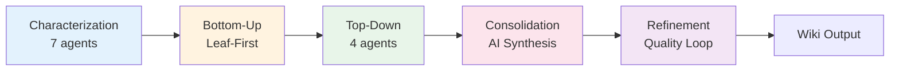

# WeaveWiki

[](https://github.com/junyeong-ai/weavewiki/actions)
[](https://www.rust-lang.org)
[![DeepWiki](https://img.shields.io/badge/DeepWiki-junyeong--ai%2Fweavewiki-blue.svg?logo=data:image/png;base64,iVBORw0KGgoAAAANSUhEUgAAACwAAAAyCAYAAAAnWDnqAAAAAXNSR0IArs4c6QAAA05JREFUaEPtmUtyEzEQhtWTQyQLHNak2AB7ZnyXZMEjXMGeK/AIi+QuHrMnbChYY7MIh8g01fJoopFb0uhhEqqcbWTp06/uv1saEDv4O3n3dV60RfP947Mm9/SQc0ICFQgzfc4CYZoTPAswgSJCCUJUnAAoRHOAUOcATwbmVLWdGoH//PB8mnKqScAhsD0kYP3j/Yt5LPQe2KvcXmGvRHcDnpxfL2zOYJ1mFwrryWTz0advv1Ut4CJgf5uhDuDj5eUcAUoahrdY/56ebRWeraTjMt/00Sh3UDtjgHtQNHwcRGOC98BJEAEymycmYcWwOprTgcB6VZ5JK5TAJ+fXGLBm3FDAmn6oPPjR4rKCAoJCal2eAiQp2x0vxTPB3ALO2CRkwmDy5WohzBDwSEFKRwPbknEggCPB/imwrycgxX2NzoMCHhPkDwqYMr9tRcP5qNrMZHkVnOjRMWwLCcr8ohBVb1OMjxLwGCvjTikrsBOiA6fNyCrm8V1rP93iVPpwaE+gO0SsWmPiXB+jikdf6SizrT5qKasx5j8ABbHpFTx+vFXp9EnYQmLx02h1QTTrl6eDqxLnGjporxl3NL3agEvXdT0WmEost648sQOYAeJS9Q7bfUVoMGnjo4AZdUMQku50McDcMWcBPvr0SzbTAFDfvJqwLzgxwATnCgnp4wDl6Aa+Ax283gghmj+vj7feE2KBBRMW3FzOpLOADl0Isb5587h/U4gGvkt5v60Z1VLG8BhYjbzRwyQZemwAd6cCR5/XFWLYZRIMpX39AR0tjaGGiGzLVyhse5C9RKC6ai42ppWPKiBagOvaYk8lO7DajerabOZP46Lby5wKjw1HCRx7p9sVMOWGzb/vA1hwiWc6jm3MvQDTogQkiqIhJV0nBQBTU+3okKCFDy9WwferkHjtxib7t3xIUQtHxnIwtx4mpg26/HfwVNVDb4oI9RHmx5WGelRVlrtiw43zboCLaxv46AZeB3IlTkwouebTr1y2NjSpHz68WNFjHvupy3q8TFn3Hos2IAk4Ju5dCo8B3wP7VPr/FGaKiG+T+v+TQqIrOqMTL1VdWV1DdmcbO8KXBz6esmYWYKPwDL5b5FA1a0hwapHiom0r/cKaoqr+27/XcrS5UwSMbQAAAABJRU5ErkJggg==)](https://deepwiki.com/junyeong-ai/weavewiki)

> **English** | **[한국어](README.md)**

**AI documents your entire codebase perfectly.** 100% file coverage, 100% fact-based — no file left behind, no speculation.

---

## Why WeaveWiki?

- **100% Coverage** — Every source file explicitly documented
- **Fact-Based** — Only observable facts from code, no guessing
- **Multi-Agent** — 6-phase AI pipeline for deep analysis
- **Resumable** — Stop anytime and continue where you left off

---

## Core Technology

### 6-Phase Multi-Agent Pipeline



| Core Algorithm | Description |
|----------------|-------------|
| **Multi-Turn Characterization** | 7 agents across 3 turns build project profile |
| **Deep Research** | 3-4 iteration deep analysis for Core/Important files |
| **Leaf-First Processing** | Hierarchical context building from simple to complex |
| **TALE Budget Management** | Dynamic token reallocation for predictable costs |
| **5-Dimension Quality Score** | Coverage, completeness, accuracy, diagrams, clarity |

> Detailed architecture: **[ARCHITECTURE.en.md](ARCHITECTURE.en.md)**

---

## Quick Start

```bash
# Install
cargo install weavewiki

# Initialize and generate
cd your-project
weavewiki init
weavewiki generate

# Check results
ls .weavewiki/wiki/
```

---

## Key Features

### Documentation Generation
```bash
weavewiki generate                    # Default analysis
weavewiki generate --mode deep        # Deep analysis
weavewiki generate --resume           # Resume previous session
weavewiki generate --status           # Check progress
weavewiki generate --dry-run          # Preview config only
```

### Knowledge Graph
```bash
weavewiki build                       # Analyze code structure
weavewiki query "src/main.rs"         # Query dependencies
weavewiki validate                    # Verify doc-code consistency
```

### Management
```bash
weavewiki init                        # Initialize project
weavewiki status                      # Check status
weavewiki clean --all                 # Clean data
weavewiki config show                 # Show config
```

---

## Installation

### Cargo
```bash
cargo install weavewiki
```

### Build from Source
```bash
git clone https://github.com/junyeong-ai/weavewiki && cd weavewiki
cargo build --release
```

**Requirements**: Rust 1.92.0+

---

## LLM Providers

### Claude Code (Default)
```bash
# No API key needed - uses Claude Code CLI
weavewiki generate
```

### OpenAI
```bash
export OPENAI_API_KEY="sk-..."
weavewiki generate --provider openai --model gpt-4o
```

### Ollama (Local)
```bash
weavewiki generate --provider ollama --model llama3
```

---

## Analysis Modes

| Mode | Description | Use Case |
|------|-------------|----------|
| `fast` | Quick overview | Large project preview |
| `standard` | Balanced analysis | General documentation (default) |
| `deep` | Deep analysis | Detailed docs needed |

```bash
weavewiki generate --mode deep --quality-target 0.9
```

---

## Configuration

`.weavewiki/config.toml`:
```toml
[project]
name = "my-project"

[llm]
provider = "claude-code"
model = "claude-sonnet-4-20250514"

[analysis]
mode = "standard"
quality_target = 0.8
```

---

## Output Structure

```
.weavewiki/wiki/
├── index.md              # Project overview
├── llms.txt              # AI agent context
├── patterns.md           # Discovered patterns
├── constitution.md       # Coding conventions
└── domains/              # Domain-specific docs
    ├── core/
    ├── api/
    └── storage/
```

---

## Supported Languages

**Parser Support (AST Analysis)**: Rust, Go, Python, TypeScript, JavaScript, Java, Kotlin, C, C++, Ruby, Bash

**Language Detection**: 30+ languages

---

## Troubleshooting

```bash
# Reset data
weavewiki clean --all && weavewiki init

# Check progress
weavewiki generate --status

# Debug mode
RUST_LOG=debug weavewiki generate
```

---

## Support

- [GitHub Issues](https://github.com/junyeong-ai/weavewiki/issues)
- [Developer Guide](CLAUDE.md)

---

<div align="center">

**English** | **[한국어](README.md)**

Made with Rust

</div>
